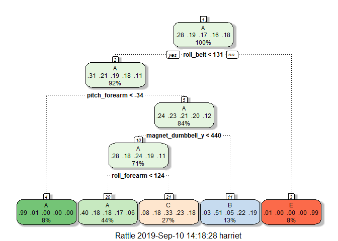
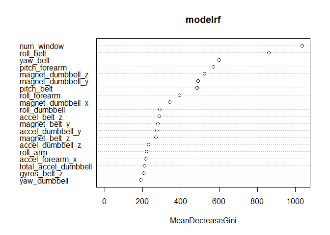

---
output:
  html_document: 
    keep_md: yes
  pdf_document: default
---

# Prediction of the qualitiy of the quantified self

## Overview
One thing that people regularly do is quantify how much of a particular activity they do, but they rarely quantify how well they do it. 6 participants were asked to perform Unilateral Dumbbell Biceps Curls in 5 different ways: exactly according to the specification (Class A), throwing the elbows to the front (Class B), lifting the dumbbell only halfway (Class C), lowering the dumbbell only halfway (Class D) and throwing the hips to the front (Class E). More information is available from this [website](http://web.archive.org/web/20161224072740/http:/groupware.les.inf.puc-rio.br/har).

This analysis uses data from accelerometers on the belt, forearm, arm, and dumbell and aims to predict how well the participants did the exercise. After comparison of three models, the prediction model based on **Random Forests** results in the highest accuracy. 

## Data

### Description of data
There is a data sample for training and test purposes and a validation sample available:

### Load package and data

```r
library(caret)
library(randomForest)
library(rattle)

urldata <- "https://d396qusza40orc.cloudfront.net/predmachlearn/pml-training.csv"
download.file(urldata, "data.csv")
data <- read.csv("data.csv",header=TRUE, sep=",")

urlvalidation <- "https://d396qusza40orc.cloudfront.net/predmachlearn/pml-testing.csv"
download.file(urlvalidation, "validation.csv")
validation <- read.csv("validation.csv",header=TRUE, sep=",")

options(scipen=999)
dim(data)
```

```
## [1] 19622   160
```

```r
dim(validation)
```

```
## [1]  20 160
```

### Cleaning of data: Reducing variables

```r
#Dealing with NA: Change empty spaces and DIV/0 to be NA and remove variables that are mostly NA (threshlod 95 %)
data[data == ""] <- NA
data[data=="#DIV/0!"] <- NA
data[data=="<NA>"] <- NA
naVar <- sapply(data, function(x) mean(is.na(x))) > 0.95
data <- data[ , naVar == FALSE]
dim(data) #100 variables less
```

```
## [1] 19622    60
```

```r
#Dealing with NZ: remove variables that are near to zero
nzVar <- nearZeroVar(data)
data <- data[ , -nzVar]
dim(data) #1 variable less
```

```
## [1] 19622    59
```

```r
#Skip five first columns - no predictors
data <- data[ , -(1:5)]
dim(data) #5 variables less
```

```
## [1] 19622    54
```

## Modelling

### Preparation: Split in train and test segment

```r
set.seed(317)
in_train  <- createDataPartition(data$classe, p=0.75, list=FALSE)
train <- data[ in_train, ]
test  <- data[-in_train, ]
dim(train)
```

```
## [1] 14718    54
```

```r
dim(test)
```

```
## [1] 4904   54
```

### Classification Tree

```r
set.seed(317)
modelcart <- train(classe~.,data=train, method="rpart")
modelcart
```

```
## CART 
## 
## 14718 samples
##    53 predictor
##     5 classes: 'A', 'B', 'C', 'D', 'E' 
## 
## No pre-processing
## Resampling: Bootstrapped (25 reps) 
## Summary of sample sizes: 14718, 14718, 14718, 14718, 14718, 14718, ... 
## Resampling results across tuning parameters:
## 
##   cp          Accuracy   Kappa     
##   0.03883034  0.5489824  0.42222872
##   0.05962214  0.4001239  0.18138149
##   0.11373778  0.3361201  0.07797264
## 
## Accuracy was used to select the optimal model using the largest value.
## The final value used for the model was cp = 0.03883034.
```

```r
varImp(modelcart)
```

```
## rpart variable importance
## 
##   only 20 most important variables shown (out of 53)
## 
##                   Overall
## pitch_forearm      100.00
## roll_forearm        72.42
## roll_belt           69.81
## magnet_dumbbell_y   48.51
## accel_belt_z        43.11
## magnet_belt_y       40.99
## num_window          40.86
## yaw_belt            40.85
## magnet_dumbbell_z   37.09
## total_accel_belt    35.40
## magnet_arm_x        27.64
## accel_arm_x         26.86
## roll_arm            15.34
## yaw_dumbbell         0.00
## gyros_arm_y          0.00
## gyros_belt_y         0.00
## gyros_dumbbell_y     0.00
## accel_forearm_z      0.00
## accel_dumbbell_x     0.00
## roll_dumbbell        0.00
```

```r
fancyRpartPlot(modelcart$finalModel)
```

<!-- -->

```r
predictcart_train <- predict(modelcart,train)
predictcart_test <- predict(modelcart,test)

confusionMatrix(predictcart_train, train$classe)$overall[1]
```

```
##  Accuracy 
## 0.4937492
```

```r
confusionMatrix(predictcart_test, test$classe)$overall[1]
```

```
##  Accuracy 
## 0.5010196
```

- 49,37% Accuracy on train data
- 50,10% Accuracy on test data
- Not very satisfying.

### Random Forest

```r
set.seed(317)
modelrf <- randomForest(classe ~. , data=train, method="class")
modelrf
```

```
## 
## Call:
##  randomForest(formula = classe ~ ., data = train, method = "class") 
##                Type of random forest: classification
##                      Number of trees: 500
## No. of variables tried at each split: 7
## 
##         OOB estimate of  error rate: 0.22%
## Confusion matrix:
##      A    B    C    D    E  class.error
## A 4183    1    0    0    1 0.0004778973
## B    4 2843    1    0    0 0.0017556180
## C    0    5 2561    1    0 0.0023373588
## D    0    0   14 2398    0 0.0058043118
## E    0    0    0    6 2700 0.0022172949
```

```r
#varImp(modelrf)
varImpPlot(modelrf,sort=TRUE,n.var=20)
```

<!-- -->

```r
predictrf_train <- predict(modelrf, train)
predictrf_test <- predict(modelrf, test)

confusionMatrix(predictrf_train, train$classe)$overall[1]
```

```
## Accuracy 
##        1
```

```r
confusionMatrix(predictrf_test, test$classe)$overall[1]
```

```
##  Accuracy 
## 0.9973491
```

Estimate of error rate 0.22%

- 100,00% Accuracy on train data - danger of overfitting!
- 99,73% Accuracy on test data
- A bit too good?

### Linear Discriminant Analysis

```r
set.seed(317)
modellda <- train(classe~.,data=train, method="lda")
modellda
```

```
## Linear Discriminant Analysis 
## 
## 14718 samples
##    53 predictor
##     5 classes: 'A', 'B', 'C', 'D', 'E' 
## 
## No pre-processing
## Resampling: Bootstrapped (25 reps) 
## Summary of sample sizes: 14718, 14718, 14718, 14718, 14718, 14718, ... 
## Resampling results:
## 
##   Accuracy   Kappa   
##   0.7132774  0.637187
```

```r
predictlda_train <- predict(modellda, train)
predictlda_test <- predict(modellda, test)

confusionMatrix(predictlda_train, train$classe)$overall[1]
```

```
##  Accuracy 
## 0.7191194
```

```r
confusionMatrix(predictlda_test, test$classe)$overall[1]
```

```
##  Accuracy 
## 0.7110522
```

- 71,92% Accuracy on train data
- 71,15% Accuracy on test data
- moderate

### Summary
The prediction model based on **Random Forests** results in the highest accuracy.
The Random Forest model will be used to predict the validation set.


```r
#levels(validation$new_window) <- levels(train$new_window)
predict(modelrf,validation)
```

```
##  1  2  3  4  5  6  7  8  9 10 11 12 13 14 15 16 17 18 19 20 
##  B  A  B  A  A  E  D  B  A  A  B  C  B  A  E  E  A  B  B  B 
## Levels: A B C D E
```


### Software Environment

```r
sessionInfo()
```

```
## R version 3.6.1 (2019-07-05)
## Platform: x86_64-w64-mingw32/x64 (64-bit)
## Running under: Windows 10 x64 (build 18362)
## 
## Matrix products: default
## 
## locale:
## [1] LC_COLLATE=German_Austria.1252  LC_CTYPE=German_Austria.1252   
## [3] LC_MONETARY=German_Austria.1252 LC_NUMERIC=C                   
## [5] LC_TIME=German_Austria.1252    
## 
## attached base packages:
## [1] stats     graphics  grDevices utils     datasets  methods   base     
## 
## other attached packages:
## [1] rattle_5.2.0        randomForest_4.6-14 caret_6.0-84       
## [4] ggplot2_3.2.0       lattice_0.20-38    
## 
## loaded via a namespace (and not attached):
##  [1] tidyselect_0.2.5   xfun_0.8           purrr_0.3.2       
##  [4] reshape2_1.4.3     splines_3.6.1      colorspace_1.4-1  
##  [7] generics_0.0.2     htmltools_0.3.6    stats4_3.6.1      
## [10] yaml_2.2.0         survival_2.44-1.1  prodlim_2018.04.18
## [13] rlang_0.4.0        e1071_1.7-2        ModelMetrics_1.2.2
## [16] pillar_1.4.2       glue_1.3.1         withr_2.1.2       
## [19] RColorBrewer_1.1-2 foreach_1.4.7      plyr_1.8.4        
## [22] rpart.plot_3.0.8   lava_1.6.6         stringr_1.4.0     
## [25] timeDate_3043.102  munsell_0.5.0      gtable_0.3.0      
## [28] recipes_0.1.6      codetools_0.2-16   evaluate_0.14     
## [31] knitr_1.23         class_7.3-15       Rcpp_1.0.1        
## [34] scales_1.0.0       ipred_0.9-9        digest_0.6.20     
## [37] stringi_1.4.3      dplyr_0.8.3        grid_3.6.1        
## [40] tools_3.6.1        magrittr_1.5       lazyeval_0.2.2    
## [43] tibble_2.1.3       crayon_1.3.4       pkgconfig_2.0.2   
## [46] MASS_7.3-51.4      Matrix_1.2-17      data.table_1.12.2 
## [49] lubridate_1.7.4    gower_0.2.1        assertthat_0.2.1  
## [52] rmarkdown_1.14     iterators_1.0.12   R6_2.4.0          
## [55] rpart_4.1-15       nnet_7.3-12        nlme_3.1-140      
## [58] compiler_3.6.1
```

This analysis was a project for the course "Machine Learning" from Johns Hopkins on Coursera.
